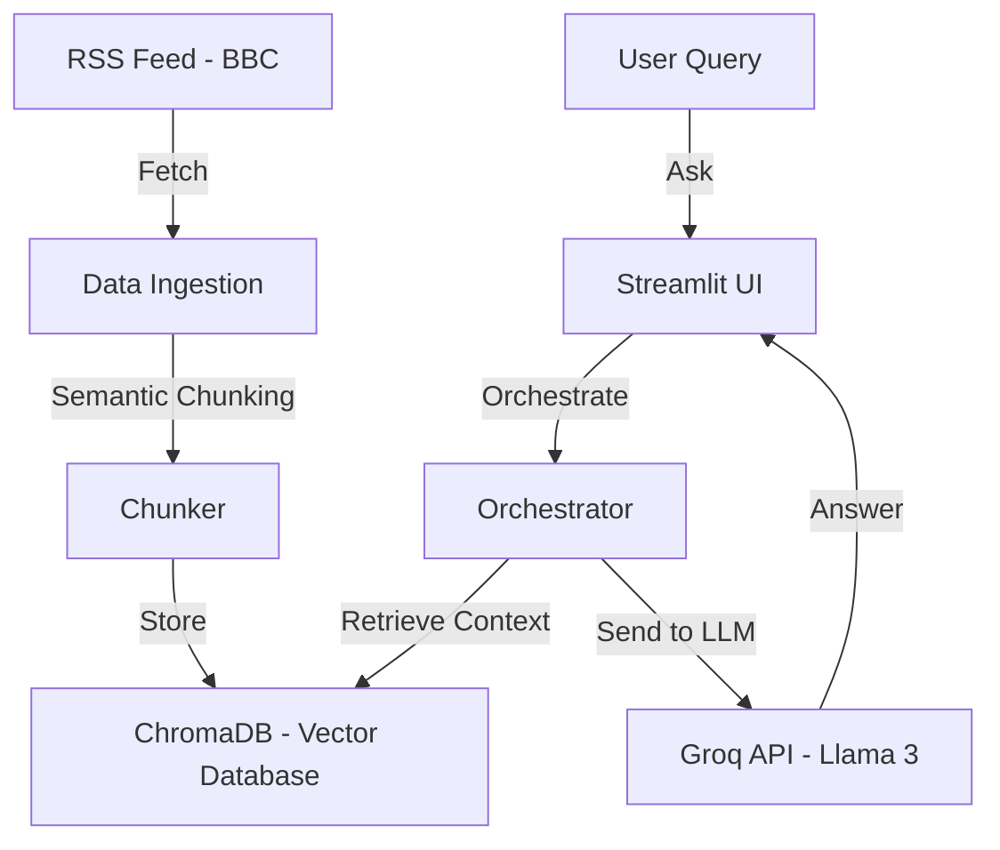

# UK Economic Insight Agent

This document explains the "Free Stack" agent we built step-by-step.

## 1. The Architecture
We built an agent that doesn't just "chat" but actually **researches** separately from **answering**.



## 2. The Components (Step-by-Step)

### Step 1: `src/prompts.py` (The Instructions)
We defined "Job Descriptions" for the AI.
- **REPORT_PROMPT**: Taught the AI how to be a Researcher (read many docs, summarize themes).
- **QA_PROMPT**: Taught the AI how to be a Customer Service Rep (answer safely using only provided data).

### Step 2: `src/chunking_utils.py` (The Brain)
Instead of chopping text blindly every 500 characters, we used **Semantic Chunking**.
- **How**: It uses a small local model (`all-MiniLM-L6-v2`) to turn sentences into math (vectors).
- **Why**: IF "Sentence A" and "Sentence B" are mathematically similar, they stay together. If the topic changes, it cuts the chunk. This preserves meaning.

### Step 3: `src/data_ingestion.py` (The Hands)
This script runs the "Nightly Build" logic (or manual refresh).
1. **Fetches** the BBC Business RSS feed.
2. **Downloads** the full article text.
3. **Chunks** it using our new tool.
4. **Saves** it to `chroma_db` folder (our long-term memory).

### Step 4: `src/orchestrator.py` (The Manager)
This connects the pieces.
- When you ask a question, it doesn't just send it to Llama 3.
- FIRST, it searches ChromaDB: "Find me the 3 most relevant paragraphs about 'inflation'."
- THEN, it sends those paragraphs + your question to the LLM.
- This is the **RAG (Retrieval Augmented Generation)** step.

### Step 5: `app.py` (The Face)
This is the Streamlit app.
- It handles the **State** (Remembering the chat history).
- It runs the **Scheduler** (To automate reports).
- It provides the **Settings** for your API key.

## 3. How to Run It

1. **Install Dependencies**:
   ```bash
   pip install -r requirements.txt
   ```

2. **Run the App**:
   ```bash
   streamlit run app.py
   ```

3. **Get a Groq API Key**:
   - Go to [console.groq.com](https://console.groq.com).
   - Sign up (free).
   - Generate a key and paste it into the app sidebar.

4. **Ingest Data**:
   - Click "Refresh Data" in the sidebar to download the latest news.
